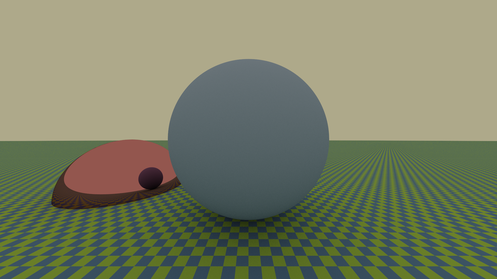

# DMF-ImaGenerator
Project for RayTracing Course @ Physics UniMi AY 21/22

This application renders simple photo-realistic images, by reading a scene from a text file, and it saves them in HDR format (PFM) and LDR format (PNG). It has now reached the (course) final version 1.0.0. It is available for MacOS and Linux. Below we present an image generated with our application.  

_Image generated with the ``demo``command and ``path-tracer``algorithm, using 10 secondary rays and 25 rays per pixel for antialiasing. Resolution is Full HD (1920x1080p)._

To install the application, simply download the .zip file ``DMF-ImaGenerator`` from the latest release. You then need to add executable rights with the Unix command: ``chmod +x DMF-ImaGenerator`` via Terminal. Then the application is ready to run via command line as ``./DMF-ImaGenerator COMMAND`` . You can also run the program using the source code via ``dotnet run``if you have [.NET6](https://dotnet.microsoft.com/en-us/) and the required libraries installed.

After donwloading the execuable, we suggest running the ``demo``command to chek if the application runs as intended. For additional help, you can call ``./DMF-ImaGenerator help``.

We noted that there is an erroneous parsing of numbers if you use a Terminal without different languages setting than English; in fact, it may interpret the wrong numbers and not generate the correct image. Consider switching to English as the Terminal usage language, or similar solutions.

# Features available

Our application allows the use of 3 commands to create an manipulates imagese in PFM and PNG format.

### ``pfm2png``
Convert a PFM image into a PNG file.  
You must input a PFM file of the image to convert. You can also specify the PNG name.

### ``demo``
Generates a demo image.  
You can choose a simple flat algorithm to generate a simple PFM image, or path-tracer / point-light for a more complex one.
This feature also has a built-in image converter, so it will convert the PFM into a PNG as weel, using the previus ``pfm2png``options.

### ``render``
Render a scene from a text file and generates an image.  
You must input a text file were the scene is described, using the syntax described below.

For every command, there are several options available that allows you to personalize the application and its output. You can view them with a description of what they do with ``./DMF-ImaGenerator help COMMAND``.

# Scene description
You can render any scene you want using the Shapes and Pigments supported. You need to write the description of the scene in a text file, similar to the ones you will find in the ``Examples`` folder, then launch the ``render``command with the file as the input.

In the scene, you can specify the Shapes and their position with a Transformation; you need to alspo specify the BRDF of the Shape (the way the obejct reflect the light. The BRDF needs a Pigment with a color in RGB format. You also need to specify where the camera (the observer) is in the scene and point light sources if you use the pointlight algorithm.

The shapes curently available are spheres and planes; we support Uniform and Specular BRFD, and Uniform, Checkered and Image Pigments.

<!---
## Syntax
You decleare the elemnts in the scene with the folllowing syntax. The word ``float``indicates a floating point number, ``int`` an integer number.

#### Elementary elements
- Color ``<float, float, float>``
- Vector ``[float, float, float]``
- Point ``(float, float, float)``

#### Transformation
You can combine transfom
- Translation ``translation(Vector)``
- Rotation on X axis of some angle ``rotation_x(float)``
- Rotation on Y axis of some angle ``rotation_y(float)``
- Rotation on Z axis of some angle ``rotation_z(float)``
- Scaling ``scaling(Vector)``
--->

In the following we present the syntax for the scne description in ENBF format

---

    scene ::= declaration*
    
    declaration ::= float_decl | plane_decl | sphere_decl | material_decl | camera_decl | pointlight_decl
    
    float_decl ::= "float" IDENTIFIER "(" number ")"
    
    plane_decl ::= "plane" "(" IDENTIFIER "," transformation ")"
    
    sphere_decl ::= "sphere" "(" IDENTIFIER "," transformation ")"
    
    material_decl ::= "material" IDENTIFIER "(" brdf "," pigment ")"
    
    camera_decl ::= "camera" "(" camera_type "," transformation "," number "," number ")"
    
    camera_type ::= "perspective" | "orthogonal"
	
	pointlight_decl ::= "pointlight" "(" point "," color "," number ")"
    
    brdf ::= diffuse_brdf | specular_brdf
    
    diffuse_brdf ::= "diffuse" "(" pigment ")"
    
    specular_brdf ::= "specular" "(" pigment ")"
    
    pigment ::= uniform_pigment | checkered_pigment | image_pigment
    
    uniform_pigment ::= "uniform" "(" color ")"
    
    checkered_pigment ::= "checkered" "(" color "," color "," number ")"
    
    image_pigment ::= "image" "(" LITERAL_STRING ")"
    
    color ::= "<" number "," number "," number ">"
    
    transformation ::= basic_transformation | basic_transformation "*" transformation
    
    basic_transformation ::= "identity" 
        | "translation" "(" vector ")"
        | "rotation_x" "(" number ")"
        | "rotation_y" "(" number ")"
        | "rotation_z" "(" number ")"
        | "scaling" "(" vector ")"
         
    number ::= LITERAL_NUMBER | IDENTIFIER
    
    vector ::= "[" number "," number "," number "]"
    
    point ::= "(" number "," number "," number ")"

---

## History
See [CHANGELOG.md](https://github.com/Dima0012/DMF-ImaGenerator/blob/master/CHANGELOG.md).

## License
This program is released under the General Public License v3.0 .
